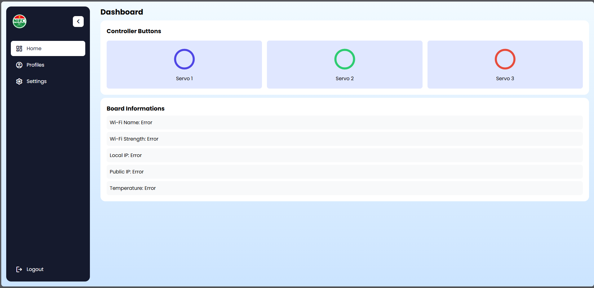

## Dashboard
Điều khiển 03 động cơ dùng để khởi động bơm khí nén được cài đặt tương ứng. Và các chức năng liên quan:
- Đăng nhập để điều khiển
- Đổi mật khẩu đăng nhập
- Đổi mạng wifi
- Điều chỉnh góc di chuyển của cơ cấu điều khiển
- Hỗ trợ điều khiển có xác thực qua API

### Khuyên cáo:

Để đảm báo các tính năng và trải nghiệm được ổn định nhất. Sử dụng với các phiên bản trình duyệt bằng hoặc lớn hơn theo bảng dưới:

|Trình duyệt|Edge|Firefox|Chrome|Safari|Opera|
| :----- | :---------- | :-------|:-------|:-------| :-------| 
|Icon||||||
|Phiên bản|93|92|93|15.4|79|

## Thông số kỹ thuật
### Hộp điều khiển
Bao gồm nguồn điện và bộ điều khiển được kết nối Wifi dùng để điều khiển cơ cấu ấn nút cho máy bơm khí nén.
| Chỉ tiêu | Thông số | Ghi chú | 
| :----- | :---------- | :-------------- | 
| Kích thước| 300 x 400 x 200||
| Nguồn điện| 220V AC/50Hz||
| Công suất| 30 Walt||
| Chuẩn wifi| IEEE 802.11b / g / n||
| Băng tần | 2.4 GHz||
|Băng thông| 150 Mbps||
|Cơ cấu điều khiển|03||

### Cơ cấu điều khiển
Bao gồm 03 cơ cấu điều khiển dùng để ấn nút khởi động khi có yêu cầu từ người dùng qua trình diều khiển Dashboard.
|Chỉ tiêu| Thông số | Ghi chú |
|:--------|:--------|--------|
|Kích thước|300 x 150 x 100||
|Góc di chuyển|0-180 độ||
|Điện áp|5V DC||
|Từ tính| Có||

## Thông số mặc định ban đầu
### Thông tin Wifi
Router ban đầu cần được cấu hình đúng tên wifi (SSID) và mật khẩu như mặc định. Để có thể cấp phát IP Local và truy cập Dashboard. Thông tin Wifi có thể thay đổi trong cấu hình Dashboard.

**SSID: Nifc   
Mật khẩu: Nifc**

### Thông tin đăng nhập
Tài khoản mặc định ban đầu để đăng nhập vào Dashboard. Có thể thay đổi sau khi đăng nhập vào Dashboard - Profiles.

**Tên đăng nhập: admin  
Mật khẩu: 12345678**

## An toàn

**Thận trọng: Từ trường**  
Nam châm tạo ra từ trường mạnh, có phạm vi ảnh hưởng rộng. Chúng có thể làm hỏng
TV và máy tính xách tay, ổ cứng máy tính, thẻ tín dụng và thẻ ATM, phương tiện lưu trữ dữ liệu, đồng hồ cơ, máy trợ thính và loa.
• Để nam châm tránh xa các thiết bị và vật thể có thể bị hư hỏng
bởi từ trường mạnh

**Caution: Magnetic field**  
Magnets produce a far-reaching, strong magnetic field. They could dam
age TVs and laptops, computer hard drives, credit and ATM cards, data 
storage media, mechanical watches, hearing aids and speakers.
 • Keep magnets away from devices and objects that could be damaged 
by strong magnetic fields

